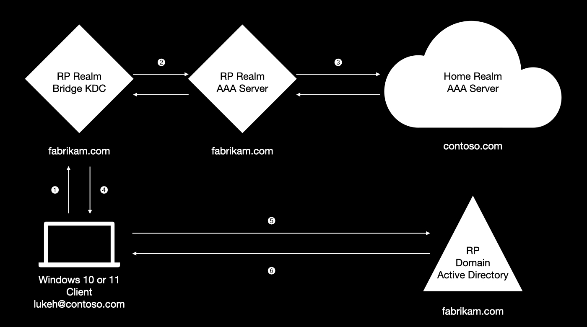

TktBridgeAP
===========

TktBridgeAP is a Windows Authentication Package (AP) that allows arbitrary Security Support Providers (SSPs) to be used to acquire Kerberos ticket granting tickets (TGTs). The protocol tunnels the SSPI token exchange inside a Kerberos pre-authentication exchange, resulting in a TGT bearing the identity of the SSPI client.

You will require a GSS-API mechanism and SSP that are supported by Heimdal and Windows respectively, for example the EAP SSP developed by PADL for Project Moonshot. TktBridgeAP implements [draft-perez-krb-wg-gss-preauth](https://datatracker.ietf.org/doc/html/draft-perez-krb-wg-gss-preauth). See [here](https://github.com/heimdal/heimdal/blob/master/lib/gss_preauth/README.md) for more information.

TktBridgeAP uses undocumented Windows APIs and is in no way supported by either PADL Software or Microsoft. It may break between Windows releases. Caveat emptor.

Architecture
------------

TktBridgeAP uses the Security Support Provider Interface (SSPI) to perform a pre-authentication exchange with a Heimdal KDC that is trusted by Active Directory. Once the user is authenticated to the KDC, Heimdal issues a ‘partial’ TGT which TktBridgeAP passes to the Windows Kerberos authentication package. Windows in turns exchanges this TGT for a full TGT which contains the user‘s validation information and can get them to the desktop. This ticket exchange is similar to how Azure Active Directory implements [FIDO authentication](https://docs.microsoft.com/en-us/azure/active-directory/authentication/howto-authentication-passwordless-security-key-on-premises).

TktBridgeAP is agnostic to the underlying credential type and is designed to work with smartcards and custom credential providers, as well as password credentials, although to date it has only been tested with the latter.

Operation
---------

When a user logs on to a workstation on which TktBridgeAP is installed, the following occurs:

* The AP validates that the logon type is supported, the workstation is joined to a domain, and it has authority to authenticate users in the supplied domain
* The credential information supplied by the caller is repacked into a form suitable for acquiring a SSPI credentials handle
* Using SSPI, the AP exchanges as many tokens as necessary with the bridge KDC in order to authenticate the user
* The KDC authorizes the SSPI client and issues a partial TGT
* The partial TGT is made available to the native Kerberos security package
* The native Kerberos security package recognizes the presence of the partial ticket, and exchanges it for a full one rather than attempting to use the user’s primary credentials
* The full ticket is used to log the user on

Workstation unlock is similar, with the refreshed ticket being transferred to the original logon session.

The following diagram shows TktBridgeAP used with EAP:



1. User signs in using `lukeh@contoso.com` NAI, workstation performs GSS EAP pre-authentication to bridge KDC in local realm `FABRIKAM.COM`
2. Bridge KDC forwards EAP messages over RADIUS to local AAA server
3. Local AAA server forwards EAP messages to user’s home realm `CONTOSO.COM`
4. Bridge KDC issues partial TGT for user `lukeh@contoso.com` in Kerberos realm `FABRIKAM.COM`, mapping user via UPN or altSecID attribute
5. Kerberos package on client workstation sends partial TGT to local AD KDC
6. AD exchanges partial TGT for full TGT containing user authorisation data, workstation logs user on

KDC configuration
-----------------

A current Heimdal master is required in order to support GSS-API pre-authentication. Synthetic principal support is also required to avoid needing to provision individual principals on the KDC. The Heimdal KDC need not contain any principals except for the default ones, and indeed its TGS (krbtgt) entry should be deleted as it will be provided from a keytab.

In this example we will use the Kerberos realm KERB.PADL.COM. Note that the TGS principal is served from a keytab: this is because it this key is shared with Active Directory, and it is not possible to set a password on a TGS account (nor to import a keytab easily into a Heimdal HDB).

Below follows an excerpt of the Kerberos configuration file `/etc/krb5.conf`:

```
[libdefaults]
    default_realm = KERB.PADL.COM

[kdc]
    ports = 88/udp 88/tcp
    allow-anonymous = true
    enable_gss_preauth = true
    synthetic_clients = true
    synthetic_clients_max_life = 1d
    synthetic_clients_max_renew = 7d
    gss_mechanisms_allowed = eap-aes128 eap-aes256
    database = {
        krbtgt = {
            dbname = keytab:/var/heimdal/rodc.keytab
            realm = KERB.PADL.COM
        }
        default = {
            dbname = /var/heimdal/heimdal.db
            realm = KERB.PADL.COM
        }
    }
```

If you are using a custom GSS mechanism, be sure to configure `/etc/gss/mech` appropriately so Heimdal can find it. Make sure too that there are no library dependency conflicts between it and the version of Heimdal the KDC is built from. Configuration of the mechanism itself (e.g. RADIUS shared secret) is not discussed here. See [here](https://wiki.eduuni.fi/display/CSCHAKA/Moonshot+service+provider) for some examples pertaining to GSS EAP. You will need the very latest `mech_eap` if you are using NegoEx.

AD configuration
----------------

The Heimdal KDC will appear to Active Directory as a Read Only Domain Controller (RODC), even though it does not implement any domain controller functionality. Use `ldapadd` to create the RODC TGS and machine accounts as an administrator per the following:

```
dn: CN=krbtgt_TktBridgeAP,CN=Users,DC=kerb,DC=padl,DC=com
control: 1.2.840.113556.1.4.1341
description: Ticket Bridge Authentication Package KDC Account
objectClass: user
showInAdvancedViewOnly: TRUE
msDS-SupportedEncryptionTypes: 24

dn: CN=TktBridgeAPKerberos,OU=Domain Controllers,DC=kerb,DC=padl,DC=com
description: Ticket Bridge Authentication Package RODC Account
objectClass: computer
userAccountControl: 83890176
primaryGroupID: 521
dNSHostName: tktbridge.kerb.padl.com
msDS-SupportedEncryptionTypes: 24
mSDS-KrbTgtLink: CN=krbtgt_TktBridgeAP,CN=Users,DC=kerb,DC=padl,DC=com
mSDS-RevealOnDemandGroup: CN=Users,CN=Builtin,DC=kerb,DC=padl,DC=com
```

This example enables all users to use GSS pre-authentication: you can restrict this by changing the value of `mSDS-RevealOnDemandGroup` above.

You then need to read back the RODC branch ID from LDAP by performing a search for `CN=krbtgt_TktBridgeAP` and requesting the `mSDS-SecondaryKrbTgtNumber` attribute. This is an integer ID that is used to distinguish the KDC from other RODCs and the main `krbtgt` account. The ID is randomly assigned by Active Directory. On my test domain controller, it is 30382, so the sAMAccountName is `krbtgt_30382`.

Use `samba-tool` to retrieve this TGS secret from the domain controller, with the following commands (adjusting environment variables appropriately):

```bash
# export TKTBRIDGEAP_REALM=KERB.PADL.COM
# export TKTBRIDGEAP_BRANCHID=30382
# export TKTBRIDGEAP_DC=dc1.kerb.padl.com

# mkdir /tmp/TktBridgeAP
# samba-tool drs clone-dc-database $TKTBRIDGEAP_REALM --include-secrets --targetdir=/tmp/TktBridgeAP --server=$TKTBRIDGEAP_DC -UAdministrator@$TKTBRIDGEAP_REALM
# samba-tool domain export-keytab /var/heimdal/rodc.keytab --configfile=/tmp/TktBridgeAP/smb.conf --principal=krbtgt_$TKTBRIDGEAP_BRANCHID
# ktutil -k /var/heimdal/rodc.keytab rename "krbtgt_$TKTBRIDGEAP_BRANCHID" "krbtgt/$TKTBRIDGEAP_REALM"
# rm -rf /tmp/TktBridgeAP
```

Note that `samba-tool` is only used to provision the KDC keytab: you do not need to keep the cloned DC database, nor configure Samba as a domain controller.

TktBridgeAP configuration
-------------------------

TktBridgeAP should be added to the Security Packages key in `HKLM\SYSTEM\CurrentControlSet\Control\Lsa` and the workstation rebooted.

To configure TktBridgeAP itself, set the `KdcHostName` string value in `HKLM\SYSTEM\CurrentControlSet\Control\Lsa\TktBridgeAP` to the hostname of the Heimdal KDC you configured above. If none is specified, then the `_kerberos-tkt-bridge` DNS SRV record will be queried for the primary DNS domain.

By default TktBridgeAP will use SPNEGO/NegoEx to authenticate to the KDC. (All versions of Heimdal that support GSS pre-authentication also support NegoEx.) You can force a single package with the `RestrictPackage` key.

To avoid locking out domain users, TktBridgeAP by default will not attempt GSS pre-authentication where the logging in domain matches an Active Directory domain (as opposed to UPN suffix). If you wish to positively associate a set of realms, it can be done with the `UPNSuffixes` registry key. This key is authoritative.

There are a variety of additional flags which can be set on TktBridgeAP in the `flags` key:

* 0x01: enable debugging on release builds
* 0x02: enable the primary domain suffix for GSS pre-authentication
* 0x04: enable the trusted domain suffixes for GSS pre-authentication
* 0x08: do not cache users’ cleartext credentials (this will disable automatic ticket refresh)
* 0x10: use anonymous PKINIT FAST to wrap KDC requests
* 0x20: validate AS-REP credentials before handoff

If you have a debug build of TktBridgeAP, make sure the debug Visual C++ libraries are copied to the Windows system directory, specifically:

* `msvcp140d.dll`
* `vcruntime140d.dll`
* `vcruntime140_1d.dll`
* `ucrtbased.dll`

TktBridgeAP relies on the Heimdal client library assembly that should be installed by recent versions of EapSSP.

Test Signing
------------

If you have not signed TktBridgeAP with an extended validation (EV) code signing certificate, you will also need to do the following:

* Generate a test signing certificate and update the path in `Source/TktBridgeAP.vcxproj.user` accordingly to point to the PFX file
* Import the CA certificate into the Trusted Root Certification Authorities local machine store using `certlm.exe`
* Import the code signing certificate into the Trusted Publishers local machine store
* Enable test signing mode with the command `bcdedit /set TESTSIGNING ON`.

User configuration
------------------

To enable a user for GSS pre-authentication, they must first be a member of the group specified in `mSDS-RevealOnDemandGroup` above, and they must have their `userPrincipalName` attribute set to the GSS-API initiator name (for example, with EAP, this will be the NAI name such as `lukeh@AAA.PADL.COM`).

Heimdal also includes a `altsecid_gss_preauth_authorizer` KDC plugin that can map GSS-API initiators to Kerberos principals using the altSecurityIdentities attribute, consistent with how the EAP SSP authorizes client principals. If you install this plugin (by moving it to `/usr/heimdal/lib/plugin/kdc`) then you will need to ensure the KDC has access to outgoing credentials for performing LDAP searches in AD. You cannot use the RODC TGS account for this as it cannot act as a client, but you can use the RODC domain controller account. You may need to set `userPrincipalName` on the domain controller account to match the service principal name to avoid salting issues.

PacRequestorEnforcement
-----------------------

Recent Windows updates require TGTs to contain the security identifier (RID) of the client that requested the ticket. If the PacRequestorEnforcement registry key is set to 2 (enforce), then you must use the `altsecid_gss_preauth_authorizer' KDC plugin to include the user's SID in the TGT. Note that there still exists a race condition where the user could be renamed between authenticating and SID lookup; to fix this, the KDC would need to be modified to allow user enrolment by both name and SID, which would run contrary to the goal of making the bridge KDC as stateless as possible.

Debugging
---------

Information about pre-authentication is logged under the `TktBridgeAP/Operational` channel, enabled by default and visible in Event Viewer.

More detailed information can be obtained by setting the debugging flag in the registry and gathering a trace. To start a session:

```
logman start TktBridgeAP -p {dd29d3f8-3952-4c29-9af9-0742504de328} -o TktBridgeAP.etl -ets
```

To end and report on a session

```
logman stop TktBridgeAP -ets
tracerpt TktBridgeAP.etl
```
